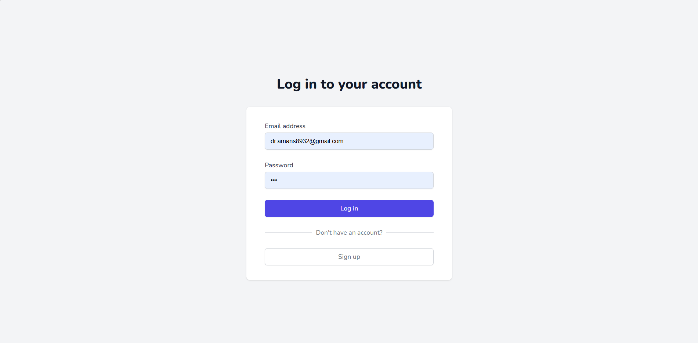
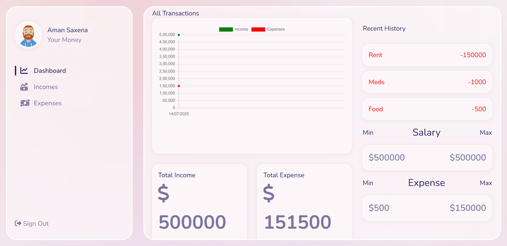
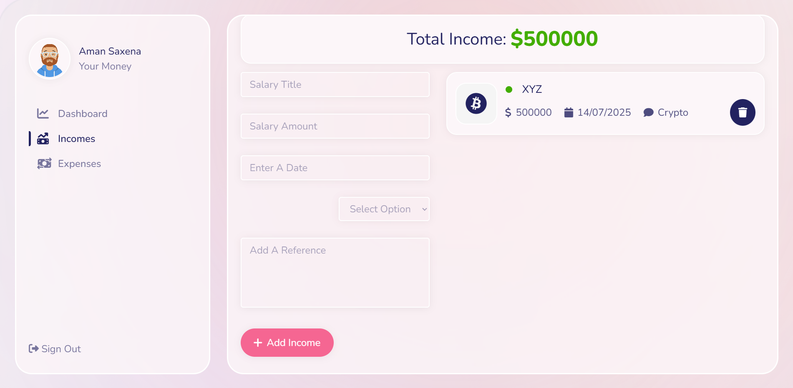
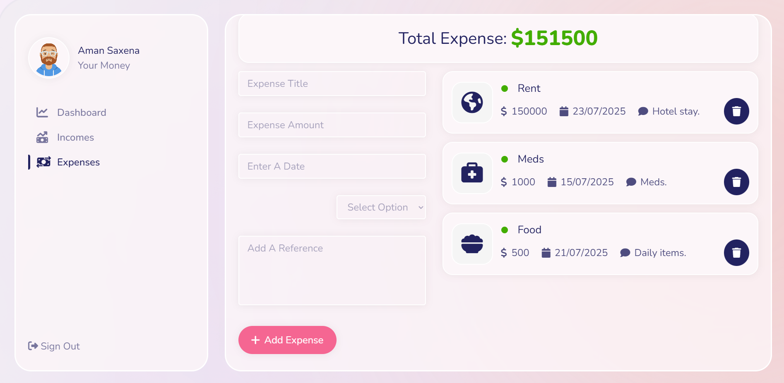

# 💰 Expense Tracker

A full-stack Expense Tracker web application that helps users manage incomes and expenses efficiently. Built using the MERN stack with Tailwind CSS for UI styling.

---

## 📁 Project Structure

```
expense-tracker/
├── backend/        # Express.js backend with MongoDB
├── frontend/       # React.js frontend with Tailwind CSS
```

---

## 🚀 Features

- Track incomes and expenses
- Visualize financial summary
- Secure API with user authentication
- Responsive UI with Tailwind CSS
- Modular backend (controllers, routes, models)

---

## ⚙️ Tech Stack

### Frontend:
- React.js
- Tailwind CSS
- Axios

### Backend:
- Node.js + Express.js
- MongoDB + Mongoose
- JWT Authentication
- dotenv

---

## 🛠️ Installation & Setup

### 1. Clone the Repository

```bash
git clone <https://github.com/aman0iz0back/expense-tracker>
cd expense-tracker
```

### 2. Setup Backend

```bash
cd backend
npm install
```

**Create a `.env` file** inside `backend/`:

```env
PORT=5000
MONGO_URI=<mongodb://localhost:27017/exp-track>
JWT_SECRET=<secret>
```

To run the server:

```bash
node app.js
```

### 3. Setup Frontend

```bash
cd ../frontend
npm install
npm start
```

This starts the React app at `http://localhost:3000`.

---

## 🔐 Environment Variables

Ensure your `.env` in `backend/` contains:

- `PORT`
- `MONGO_URI`
- `JWT_SECRET`

You can use MongoDB Atlas or a local instance.

---

## 📸 Screenshots









---

## 📦 Dependencies

### Backend:
- express
- mongoose
- bcryptjs
- jsonwebtoken
- dotenv
- cors

### Frontend:
- react
- axios
- tailwindcss
- react-router-dom

---

## 🧑‍💻 Author

**Aman Saxena**
